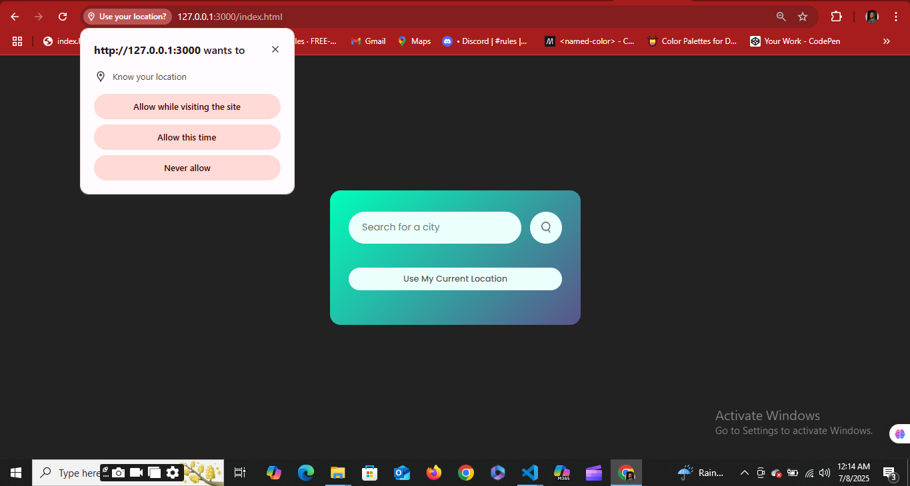

# WEATHER-APP

# Take A Look
Syntax: 

# ☁️ My Awesome Weather App

A sleek and modern web application that provides real-time weather information for any city worldwide, or for your current location using geolocation.

## ✨ Features

* **Search by City:** Get instant weather details for any city by typing its name in the search bar.
* **Current Location Weather:** Utilize your browser's geolocation feature to automatically fetch weather data for your precise current location.
* **Dynamic UI Updates:** The app dynamically displays temperature, city name, humidity, and wind speed.
* **Interactive Design:** Clean and responsive user interface designed for a smooth experience.
* **Error Handling:** Provides user-friendly messages for invalid city names, network issues, or geolocation access problems.

# Take A Look
Syntax: 
Syntax: 


## 🚀 Technologies Used

* **HTML5:** For the basic structure of the web page.
* **CSS3:** For styling the application, making it visually appealing and responsive.
* **JavaScript (ES6+):** For all the dynamic functionality, API calls, and UI manipulation.
* **OpenWeatherMap API:** To fetch accurate and up-to-date weather data.
* **Google Fonts (Poppins):** For stylish and readable typography.

## 🛠️ Setup and Installation

Follow these steps to get a copy of the project up and running on your local machine.

### Prerequisites

* A modern web browser (Chrome, Firefox, Edge, Safari).
* A text editor (e.g., VS Code, Sublime Text).
* (Optional but recommended) A local server environment for testing, though simply opening `index.html` will work for basic functionality.

### Get Your API Key

1.  Go to the [OpenWeatherMap website](https://openweathermap.org/api).
2.  Sign up for a free account.
3.  Once logged in, navigate to the "API keys" tab to get your unique API key.
4.  **Replace `"d52dff770081746fc796a311ebaabfdb"`** in `index.js` with your newly obtained API key.

### Clone the Repository

```bash
git clone <https://github.com/Stephen-Garry-Git/WEATHER-APP>
cd weather-app